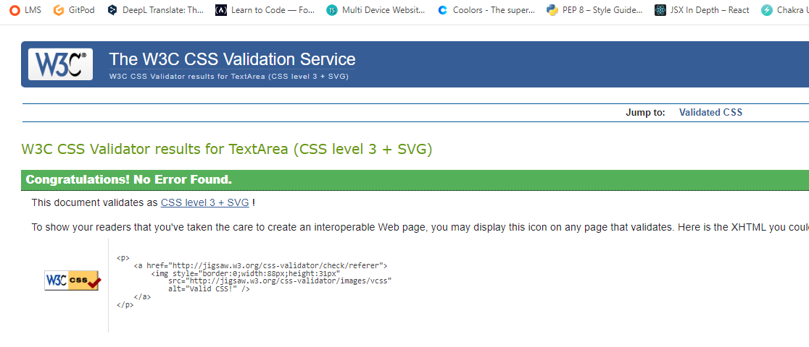
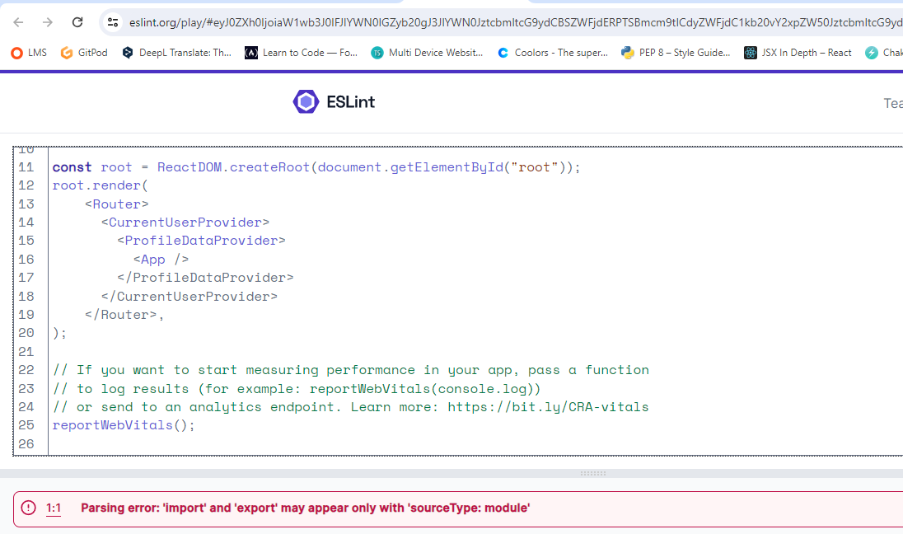
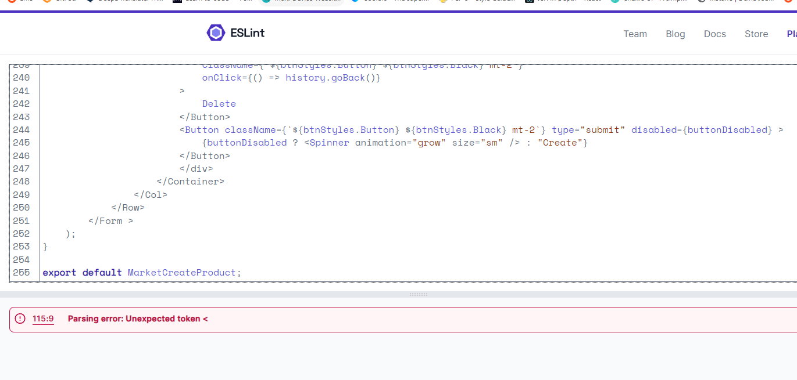
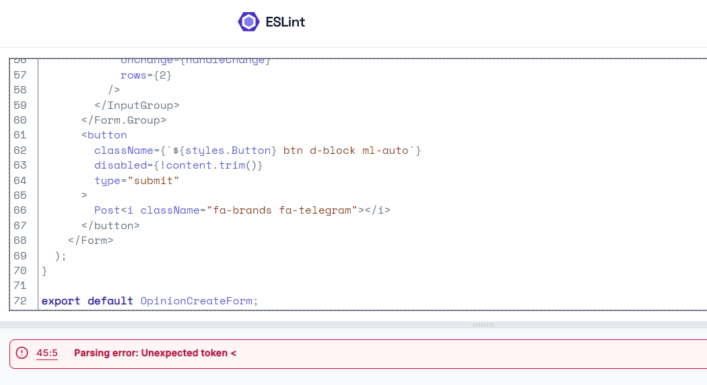
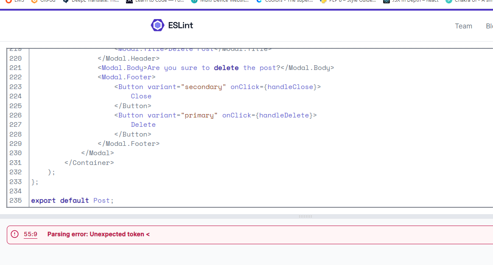

# Alternative Travels

Welcome to Alternative Travels!

Bored of travelling to famous locations packed with tourists? If yes, Alternative Travels could be what you are looking for. Alternative Travels is a social media app designed to help travellers discover unknow locations and the hidden beauty behind places that could look "decadent" or unconventional at first sight. In these locations you won't find the usual shopping street that looks the same all around the world with Louis Vitton, Zara and HM, but you will get in real contact with the feelings of time and history of the place, you will experience simple and authentic life of some of the locals living there, you will find handcrafted and vintage artifacts and could get lost in those marvelous worlds.

The live link of our Fronted Website can be found here - [Alternative Travels](https://alternative-travel-54fe13e24a2a.herokuapp.com/)

## 

Here below the links to the <strong>Backend  API</strong>:

[Live Backend Website](https://alternative-travels-debb28d8ca03.herokuapp.com/)

[Backend Repository](https://github.com/aedoardo1990/alternative-travels-api)

## Table of Contents
- [Design](#design)
- [Features](#features)
  - [Existing Features](#existing-features)
  - [Future Features](#future-features)
- [Agile Methodology](#agile-methodology)
- [Testing](#testing)
  - [User Stories Testing](#user-stories-testing)
- [Deployment](#deployment)
- [Technologies Used](#technologies-used)
- [Bugs](#bugs)
- [Credits](#credits)
- [Acknowledgments](#acknowledgments)

## Design

### Color scheme

The site has a clean and simple design to provide users with easy access to essential information for their trips. 

The main colors chosen for the website are the following ones.

### Imagery

In the login, signup and notfound pages the wheel displayed is the one of the Amusements Park of the sadly known city of Chernobyl. This location, despite the tragedy that happened in 1986 and before the ongoing war between Russia and Ukraine, has been visited in the recent years by tourists. It symbolizes how decadent or  so called "not positive" places can spark the interests of people around the world.

### Fonts

Font used is Roboto. The font was imported via Google Fonts. The back-up font is sans-serif.

### Wireframes

The wireframes for the "Alternative Travels" website were created with Figma. Due to lack of time they were designed in a simple way. Their quality will be improved at a later point.

## Features

### Exisisting Features

#### User authentication

Users can create an account, log in and log out. 

<strong>View Logged Out User</strong>

If a user is not registered to the site, he/she will have only access to check the Posts on the HomePage and the Profile page of the most followed profiles. As in the screenshot below, just the Home, Login and SignUp Icons are displayed to the Logged Out user.

<strong>View Logged In User</strong>

If a user is registered to the site, he/she will have access to all the Features of the website. As in the screenshot below, all the menu Icons are available in the Navbar to the Logged In user.

#### Profiles 

Site users can customize their profile by adding a profile picture and a short bio. Moreover, in their Profile, they can as well change their username and password by clicking on the 3 dots in the top right corner. The profile of each user is accessible by clicking on the Profile photo of the user. 

#### Create Posts with Images

A logged in user can create posts with images by clicking on the Post icon in the navbar. 

He will then be asked to choose to create a post either with image or video. 

When Post with image is selected, the following view will appear to the user. All the fields are to be filled out, otherwise error messages will pop up that field can't be left blank. 

#### Create Posts with Videos

A logged in user can create posts with videos by clicking on the Post icon in the navbar. The process is the same as for creating posts with images. The only difference is that the user has to choose the option to create a post with video.

The below is the form to create the post with a video. 

#### Geolocation

Geolocation is a mandatory field to fill out when creating a post with image or video. It can be selected by allowing the GPS of the device the user is using to detect his/her location or it can be selected manually on the world map of the website.

#### Map

The Map can be accessed via the Map tab. It is one of the main features of the site. On the map the logged in user can view all the geolocations of the posts of other users. 

By clicking on each marker, it is possible to check which user did the post and to be redirected to the post by clicking on it. 

#### Edit and Delete created Posts

A logged in user can edit and delete his/her posts by clicking on the image/video of the his/her post and by clicking on the dots in the top right corner. All the fields can be edited.

If the user wants to delete the post, he/she will be asked first, if he/she is sure to take that action.

#### Tags

This is a mandatory field for the user to fill out when creating a post with image or video. Tags have to be entered as comma separated values.

#### Comments

Logged in user can comment posts. If they want to delete a comment, they will be asked if they are sure to take the action.

#### Likes

Logged in user can like posts. They can not like the posts they created, but just those of other users. They can unlike the post they liked before.

#### Searchbar

Searchbar allows to look for posts by their tag, title or user.

#### Sell

By clicking on the Sell button in the Navbar, logged in users can post an item or artifact they found during a trip, that they wish to sell. 

Below is the creation form. All the fields are mandatory.

#### Market

By clicking on the Market Tab in the Navbar, the logged in users can check all the posts related to artifacts and products that other users wish to sell. By clicking on "check details and contact", a modal will open to highlight all the contact details for the users to get in contact if interested.

A few information about the following fields of Product posts:
- Condition -> There are 3 options to select for the user, which are New, Used, Used Like New. If the first one is selected, color of condition in the post will  be green. If the other 2 are selected color will be yellow
- Status -> There 2 options to select for the user, which are Available and Sold. Colors for them are respectively green and red.

Via the Searchbar is possible to filter posts under the market tab via title, condition, status or price. It is not possible to add tags and geolocation to the posts of this section.

#### Comment and Likes for Market Posts

Comments and likes information mentioned above are valid as well for the Market Posts. Logged in Users can like and comment Market posts.

#### Follow Unfollow Users

Logged in Users can follow other users if they want to keep updated with their content. If they want, they can unfollow them as well.

#### Home

Here there are all the posts of all the users (but not the Market Posts).

#### Feed

The logged in user will view here all the new posts of the users he/she is following.

#### Liked Pages

The logged in user will view here all the posts he/she liked (but not the Market Posts)

### Future Features

#### Live Notifications

For the future development of the site we want to implement a live notification functionality, so that users could get updated in real time if an other user likes or comments on one of his/her posts, or if new posts have been posted by followed users. This will help creating a community within the website.

#### Live Chat

Option to write in real time with other users. 

#### Events 

We would like to implement a functionality for travellers to organise meet ups between them during their travels. If they are new to a place, this would help them meeting other people. This functionality could include as well an option to organize travels together among users.

#### Site redirection to Booking/AirBnb

We would like to implement the option to be redirected from our website to the available accomodations on Booking/AirBnb if a user is intered to travel to a specific location.

## User Stories

The frontend section of the project focuses on the usage of the website from the perspective of a site user. The User Stories are divided into the following categories:

#### Navbar & Routing 
- As a site user I want to view a navbar in every page so that I can navigate easily between pages
- As a site user I want to navigate through pages easily so that I can view content without page refresh

#### Registration
- As a site user I want to create an account so that I can get access to all features of the application for signed up users.

#### Login
- As a site user I want to sign in to the website so that I can access functionality for logged in users

#### Refresh access token
- As a site user I want to keep my logged-in status until I choose to log out so that my user experience is not compromised

#### Logout
- As a site user I want to log out so that I can securely quit my session and keep my profile data safe.

#### Create Posts with images or videos
- As a site user I want to create a post, so that I can share images and youtube videos about my trips or alternative travels around the world

#### View a post
- As a site user I want to click on a post, so that I can view all the posts' details and comments of other users

#### Like Posts 
- As a site user I want to like other users' posts so that I can show my appreciation for travels and activities of other users

#### Newsfeed with infinite scrolling
- As a site user I want to view the most recent posts, so that I am up to date with the newest content

#### View posts of followed users 
- As a site user I want to see posts of followed users, so that I can keep up to date with content of users I like

#### View liked posts
- As a site user I want to view posts I liked, so that I can find again valuable information and images of interesting travels

#### Post page CRUD
- As a site user I want to create, read, update and delete my posts so that I can tailor my posts and profile according to the image I want to give to my followers and the community

#### Comments CRUD 
- As a site user I want to create, read, update and delete my comments on posts, so that I can leave my opinion on interesting topics or update/delete what I wrote if any change is needed

#### Profile page
- As a site user I want to view other user profiles so that I can learn about who they are, read their posts and follow them if I'll find them interesting

#### Popular profiles
- As a site user I want to see a list of the most followed profiles so that I can view which users are popular on the platform and decide if to follow their profiles

#### Follow or Unfollow a User
- As a site user I want to follow or unfollow a user, so that I can keep up to date with the user's posts and content

#### Edit Profile
- As a site user I want to edit my profile, so that I can keep up to date my general info, my profile photo and posts

#### Update password and username
- As a site user I want to update my password and username so that I can keep my account secure and change my displayed name on the social network

#### Geolocation
- As a site user I want to have the possibility to add a geolocation to my posts so that other users following me can know where I have travelled.

#### MarketPlace 
- As a site user I want to have a marketplace so that I can buy interesting products and relics from alternative travels of other users on the platform or alternatively I can post items to sell to other users.

## Agile Methodology

### Kanban Board

I used the Kanban Board to build the Alternative Travels Frontend using Agile principles from the start. The user stories created are from the perspective of a site user to follow and test throughout the usage of the site. The Agile Principles helped to organise how to build step by step the whole application. 

Each user story has a level of prioritisation using the MoSCoW method. The 2 different levels of prioritization are divided as below:
- must-have
- should-have

## Testing

### User Stories Testing

| Expectation (As a site user, I want to...)  | Result (As a site user, I...)    |
| :---------------------------------: | :------------------------------:|
| view a navbar in every page so that I can navigate easily between pages | can view a navbar in every page and navigate without issues in all the sections of the site |
| create an account so that I can get access to all features of the application for signed up users | can access of all the features of the app after creating an account |
| sign in to the website so that I can access functionality for logged in users | can have access to all the site features anytime I log in to the website |
| keep my logged-in status until I choose to log out so that my user experience is not compromised | can keep my logged in status until I decided to log out |
| log out so that I can securely quit my session and keep my profile data safe | can log out from my account and keep it safe |
| create a post, so that I can share images and videos about my trips or alternative travels around the world |can create posts either with images or videos of my trips |
| click on a post, so that I can view all the posts' details and comments of other users | can view all the post details after clicking on it |
| like other users' posts so that I can show my appreciation for travels and activities of other users | can like other users posts|
| view the most recent posts, so that I am up to date with the newest content | get the most recent posts in the Home, Feed and Market pages so that I always know what s new about other users|
| see posts of followed users, so that I can keep up to date with content of users I like | can see posts of followed users in my feed |
| view posts I liked, so that I can find again valuable information and images of interesting travels | can see posts I liked under Liked tab of the navbar |
| create, read, update and delete my posts so that I can tailor my posts and profile according to the image I want to give to my followers and the community | can create edit or delete my posts anytime I want|
| create, read, update and delete my comments on posts, so that I can leave my opinion on interesting topics or update/delete what I wrote if any change is needed | can create edit or delete my comments anytime I want |
| view other user profiles so that I can learn about who they are, read their posts and follow them if I'll find them interesting |can check the other users profiles by clicking on their image |
| see a list of the most followed profiles so that I can view which users are popular on the platform and decide if to follow their profiles | can see who are the most followed profiles on the site in the bar on the right side (laptop view) |
| follow or unfollow a user, so that I can keep up to date with the user's posts and content | can follow or unfollow users |
| edit my profile, so that I can keep up to date my general info, my profile photo and posts | can edit my profile photo  and description |
| update my password and username so that I can keep my account secure and change my displayed name on the social network | can change my username or password in my profile page |
| have the possibility to add a geolocation to my posts so that other users following me can know where I have travelled | can add a geolocation when creating a post |
| have a marketplace so that I can buy interesting products and relics from alternative travels of other users on the platform or alternatively I can post items to sell to other users | can access a marketplace with posts about artifacts and products of other travellers with their contact details under the market tab in the navbar. |

### Browser Testing

The Website was tested on Google Chrome, Microsoft Edge, Safari, and Firefox with no issues.

### Device Testing

The Website was tested on the following devices, OnePlusNord10, iPhone13 mini, MacBook, laptop Acer Swift SF314-43 and created for the following screen sizes: 320px, 576px, 768px, 992px, 1024px and up.

### Lighthouse Testing

The below is the result of the Lighthouse testing. I could not work on improving the results due to lack of time. This will be done at a later stage

### HTML Validator

The website was validated by URI into the validator. No errors found.

### W3C Validator - CSS

All the CSS pages were valited via direct input into the validatore. No errors found. 

- App.module.css

- Asset.module.css

- Avatar.module.css

- Button.module.css

- Comment.module.css

- CommentCreateEditForm.module.css

- LocationPicker.module.css

- Map.module.css

- MoreDropdown.module.css

- NavBar.module.css

- NotFound.module.css

- Post.module.css

- PostCreateEditForm.module.css

- PostDetail.module.css

- PostImage.module.css

- PostsPage.module.css

- PostVideo.module.css

- Profile.module.css

- ProfilePage.module.css

- SelectMedia.module.css

- SignInUpForm.module.css

- TagField.module.css

### ESLint Validator

The website was validated via [ESLint](https://eslint.org/play/). There are multiple errors for which I did not have time to review carefully. They will be corrected at a later point as I need to understand better how ESlint works. Pls find the errors below

## Bugs

### Fixed Bugs

#### Location rendering 

I was not able to render the location correctly after a new post was created. The issue was that the component was being rendered before the API data was loaded and therefore undefined values were passed to the subcomponents. This was fixed by adding some logic that helped to load the initil value of latitude and longitude and only update once the user selects a location on the map.

#### Leaflet Map rendering

Leaflet map under the Map tab was not rendering correctly. This was fixed by adding some CSS after checking a post on stackoverflow. 

### Unfixed Bugs

#### Pop up window appearing behind the searchbar

When clicking on location, pop up info appearing behind the searchbar. It should be in the front. Not able to fix it due to lack of time.

#### Tags error handling

When creating a new posts, if no tags are entered and we press submit, a toast error message should pop out but it does not.

#### Dots icon to update Profile data on the top right corner of the Profile Page

The icon on large screen is sometimes displayed out of the profile frame. I tried to fix this by adding some CSS, it works fine for the following sizes: 320, 576, 768, 992 and 1024px. But on other sizes might sometimes not be displayed correctly. 

# Deployment

### Deployment to Heroku

Once you have created a new gitpod workspace and set up the new project, you are ready to deploy to Heroku. 

1. In your heroku account, select Create New App, and give it a unique name related to your project. 
2. Select a region corresponding to where you live and click 'Create App'.
3. Head into the 'Deploy' tab select GitHub as the 'deployment method', find your project repository and click 'Connect'.
4. Click 'Deploy branch' to trigger Heroku to start building the application. 
5. Once you see the message saying 'build succeeded' you can click 'Open App' to see your application in the browser. 

### Connect React Frontend to the API backend

Once you have set up the workspace and done a basic deploy to Heroku, you can connect the react workspace to your API, in order to send data to the API

1. In the Heroku dashboard, go into the API application settings
2. In 'Settings' add a new Config Var called 'CLIENT_ORIGIN' and set that to the URL for your deployed React application. In my case, this would be [https://alternative-travel-54fe13e24a2a.herokuapp.com/](https://alternative-travel-54fe13e24a2a.herokuapp.com/).
3. Then add another Config Var called 'CLIENT_ORIGIN_DEV' and enter the URL of your Gitpod preview link, remembering to remove the trailing slash at the end. Gitpod occasionally changes this URL so keep an eye on it, as you are working on your project. 
4. Go back into your frontend Gitpod workspace, and install the Axios library using the command 'npm install axios'.
5. Create a folder called 'API' and inside it create a file called 'axiosDefaults'.
6. import axios at the top of the file
7. Define your baseURL which is the unique URL of your deployed API project. In my case this would be [https://alternative-travel-54fe13e24a2a.herokuapp.com/](https://alternative-travel-54fe13e24a2a.herokuapp.com/)
8. Set the content-type header to multi-part/form-data as the API will need to deal with images as well as text in it's requests.
9. In order to avoid any CORS issues, set withCredentials to True.
10. Import this file into App.js to be used across all pages

## Technologies Used

## Languages

- [React.js](https://en.wikipedia.org/wiki/React_(software)) - frontend JavaScript library for the base for the frontend components
- [JavaScript](https://en.wikipedia.org/wiki/JavaScript) - for the interactive elements of the website
- [HTML5](https://en.wikipedia.org/wiki/HTML) - for the content and structure for the website
- [CSS3](https://en.wikipedia.org/wiki/CSS) - for the styling for the website

### JavaScript and React Libraries
- [React-Toastify](https://www.npmjs.com/package/react-toastify) - to add alerts when actions are taken by the user
- [Axios](https://axios-http.com/) - for making HTTP requests to the API
- [Bootstrap](https://getbootstrap.com/) and [React Bootstrap](https://react-bootstrap.github.io/) - for styling and layout
- [React Router](https://reactrouter.com/en/main) - for routing
- [React Infinite Scroll Component](https://www.npmjs.com/package/react-infinite-scroll-component) - for implementing infinite scroll
- [JWT Decode](https://www.npmjs.com/package/jwt-decode) - for decoding JSON Web Tokens 
- [React Leaflet](https://react-leaflet.js.org/) - for displaying maps.

## Additional Frameworks & Software

- [Figma](https://www.figma.com/) - to create the wireframes
- [Github](https://github.com/) - Used to host the repository, store the commit history and manage the project board containing user stories
- [Gitpod](https://gitpod.io/workspaces) - Cloud development environment
- [Heroku](https://en.wikipedia.org/wiki/Heroku) - Cloud platform that the application is deployed to
- [Lighthouse](https://developer.chrome.com/docs/lighthouse/overview/) - to test site performance
- [Google Chrome DevTools](https://developer.chrome.com/docs/devtools/) - Used to debug and test responsivness of site
- [Cloudinary](https://cloudinary.com/) - Service that hosts image files and videos in the project
- [HTML Validation](https://validator.w3.org/) - Used to validate HTML code
- [CSS Validation](https://jigsaw.w3.org/css-validator/) - Used to validate CSS code
- [JSHint Validation](https://jshint.com/) - Used to validate JavaScript code
- [Google Fonts](https://fonts.google.com/) - for the Font of the website
- [Font Awesome](https://fontawesome.com/) - for the icons of the website
- [draw.io](https://app.diagrams.net/) - to create the Database diagram of the Backend readme
- [Colors](https://coolors.co/) - to create the color palette of the readme
- [Techsini](https://techsini.com/multi-mockup/index.php) - mockup generator for the readme image at the top showing how the site looks on different screen sizes and devices
- [iloveimg](https://www.iloveimg.com/) - to compress and crop images
- [tiny-img](https://tiny-img.com/webp/) - to convert images to webp format - the webp format allows the website to be lighter when loading 

## Credits

### Code used
- [CI Walkthrough Project](https://github.com/mr-fibonacci/moments/tree/bb6657e265fb18360b841e10d9d633dad06f4e5c) - for setting up the main structure of the code of my application
- [Sonic Explorers](https://github.com/nacht-falter/sonic-explorers) - for setting up the geolocation, the map and tags functionalities and as a main inspiration for my website
- [Skate Universe](https://github.com/vanderpatrick/skate-universe) - to learn how to include posts with videos in a social media app
- [Urbantrip](https://github.com/sbojorge/urbantrip) - to conditionally render either images or videos in a post
- [Stack Overflow](https://stackoverflow.com/)
- [Stack Overflow](https://stackoverflow.com/questions/35762351/correct-way-to-handle-conditional-styling-in-react) - to handle color conditional rendering in the Marketplace posts
- [Happening](https://github.com/quiltingcode/happening-react-frontend/tree/main) - to understand how to create a dropdown in the create marketplace form to create posts on the marketplace
- [Alejandro AO - Software & Ai](https://www.youtube.com/watch?v=jD6813wGdBA&t=165s) - to learn how to create the geolocation icon marker with Leaflet

### Media
- [Pinterest](https://www.pinterest.it/) - for the images posted on the website, the logo
- [Pexals](https://www.pexels.com/) - for the videos posted on the website

## Acknowledgments 

My mentor Antonio for pointing me always in the right direction. 30 minutes with him are worth 30 professional lessons.