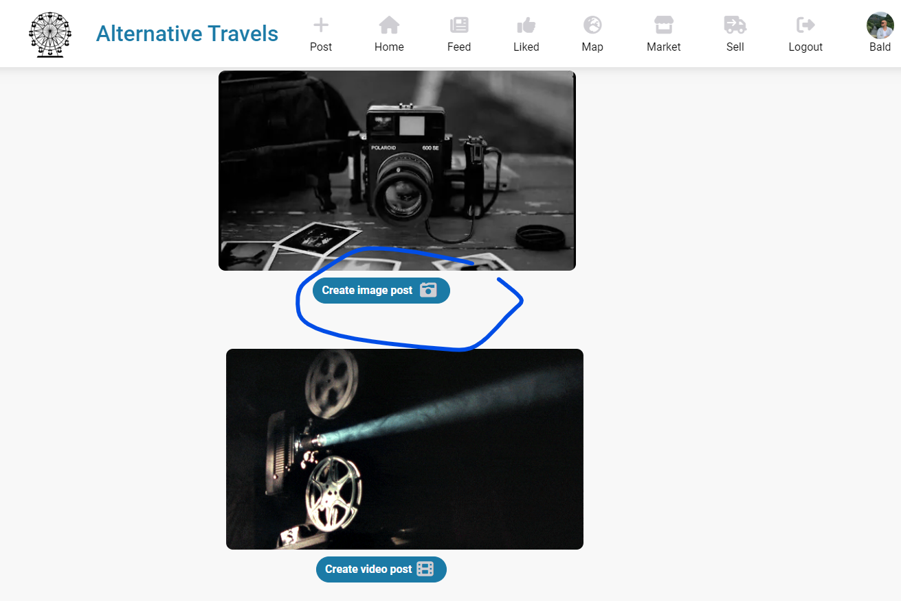

# Alternative Travels

Welcome to Alternative Travels!

Bored of travelling in famous locations packed with tourists? If yes, Alternative Travels could be what you are looking for. Alternative Travels is a social media app designed to help travellers discover unknow locations and the hidden beauty behind places that could look "decadent" or "wired" at first sight. In these locations you won't find the usual shopping street that looks the same all around the world with Louis Vitton, Zara and HM, but you will get in real contact with the feelings of time and history of the place, you will experience the simple and authentic life of some of the locals living there, you will find handcrafted and vintage artifacts and could get lost in those marvelous worlds.

The live link of our Fronted Website can be found here - [Alternative Travels](https://alternative-travel-54fe13e24a2a.herokuapp.com/)

## 

Here below the links to the <strong>Backend  API</strong>:

[Live Backend Website](https://alternative-travels-debb28d8ca03.herokuapp.com/)

[Backend Repository](https://github.com/aedoardo1990/alternative-travels-api)

## Table of Contents
- [Features](#features)
  - [Existing Features](#existing-features)
  - [Future Features](#future-features)
- [Credits](#credits)
- [Acknowledgments](#acknowledgments)

## Features

### Exisisting Features

#### User authentication

Users can create an account, log in and log out. 

<strong>View Logged Out User</strong>

If a user is not registered to the site, he/she will have only access to check the Posts on the HomePage and the Profile page of the most followed profiles. As in the screenshot below, just the Home, Login and SignUp Icons are displayed to the Logged Out user.

<strong>View Logged In User</strong>

If a user is registered to the site, he/she will have access to all the Features of the website. As in the screenshot below, all the menu Icons are available in the Navbar to the Logged In user.

#### Profiles 

Site users can customize their profile by adding a profile picture and a short bio. Moreover, in their Profile, they can as well change their username and password by clicking on the 3 dots in the top right corner. The profile of each user is accessible by clicking on the Profile photo of the user. 

#### Create Posts with Images

A logged in user can create posts with images by clicking on the Post icon in the navbar. 

He will then be asked to choose to create a post either with image or video. 

When Post with image is selected, the following view will appear to the user. All the fields are to be filled out, otherwise error messages will pop up that field can't be left blank. 

#### Create Posts with Videos

A logged in user can create posts with videos by clicking on the Post icon in the navbar. The process is the same as for creating posts with images. The only difference is that the user has to choose the option to create a post with video.

The below is the form to create the post with a video. 

#### Geolocation

Geolocation is a mandatory field to fill out when creating a post with image or video. It can be selected by allowing the GPS of the device the user is using to detect his/her location or it can be selected manually on the world map of the website.

#### Map

The Map can be accessed via the Map tab. It is one of the main features of the site. On the map the logged in user can view all the geolocations of the posts of other users. 

By clicking on each marker, it is possible to check which user did the post and to be redirected to the post by clicking on it. 

#### Edit and Delete created Posts

A logged in user can edit and delete his/her posts by clicking on the image/video of the his/her post and by clicking on the dots in the top right corner. All the fields can be edited.

If the user wants to delete the post, he/she will be asked first, if he/she is sure to take that action.

#### Tags

This is a mandatory field for the user to fill out when creating a post with image or video. Tags have to be entered as comma separated values.

#### Comments

Logged in user can comment posts. If they want to delete a comment, they will be asked if they are sure to take the action.

#### Likes

Logged in user can like posts. They can not like the posts they created, but just those of other users. They can unlike the post they liked before.

#### Searchbar

Searchbar allows to look for posts by their tag, title or user.

#### Sell

By clicking on the Sell button in the Navbar, logged in users can post an item or artifact they found during a trip, that they wish to sell. 

Below is the creation form. All the fields are mandatory.

#### Market

By clicking on the Market Tab in the Navbar, the logged in users can check all the posts related to artifacts and products that other users wish to sell. By clicking on "check details and contact", a modal will open to highlight all the contact details for the users to get in contact if interested.

A few information about the following fields of Product posts:
- Condition -> There are 3 options to select for the user, which are New, Used, Used Like New. If the first one is selected, color of condition in the post will  be green. If the other 2 are selected color will be yellow
- Status -> There 2 options to select for the user, which are Available and Sold. Colors for them are respectively green and red.

Via the Searchbar is possible to filter posts under the market tab via title, condition, status or price. It is not possible to add tags and geolocation to the posts of this section.

#### Comment and Likes for Market Posts

Comments and likes information mentioned above are valid as well for the Market Posts. Logged in Users can like and comment Market posts.

#### Follow Unfollow Users

Logged in Users can follow other users if they want to keep updated with their content. If they want, they can unfollow them as well.

#### Home

Here there are all the posts of all the users (but not the Market Posts).

#### Feed

The logged in user will view here all the new posts of the users he/she is following.

#### Liked Pages

The logged in user will view here all the posts he/she liked (but not the Market Posts)

### Future Features

#### Live Notifications

For the future development of the site we want to implement a live notification functionality, so that users could get updated in real time if an other user likes or comments on one of his/her posts, or if new posts have been posted by followed users. This will help creating a community within the website.

#### Live Chat

Option to write in real time with other users. 

#### Events 

We would like to implement a functionality for travellers to organise meet ups between them during their travels. If they are new to a place, this would help them meeting other people. This functionality could include as well an option to organize travels together among users.

#### Site redirection to Booking/AirBnb

We would like to implement the option to be redirected from our website to the available accomodations on Booking/AirBnb if a user is intered to travel to a specific location. 

## Credits

- [CI Walkthrough Project](https://github.com/mr-fibonacci/moments/tree/bb6657e265fb18360b841e10d9d633dad06f4e5c) - for setting up the main structure of the code of my application
- [Sonic Explorers](https://github.com/nacht-falter/sonic-explorers) - for setting up the geolocation and tags functionalities and as a main inspiration for my website
- [Skate Universe](https://github.com/vanderpatrick/skate-universe) - to learn how to include posts with videos in a social media app
- [Urbantrip](https://github.com/sbojorge/urbantrip) - to conditionally render either images or videos in a post

## Acknowledgments 

My mentor Antonio for pointing me always in the right direction. 30 minutes with him are worth 30 professional lessons.